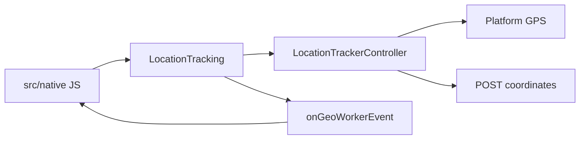

# Подключение TranslineGeoWorker к React Native

Практический гайд для разработчика хост-приложения: сборка артефактов, нативные модули, правки Android/iOS, JS-хуки, полный пример и отладка.

Детальные планы: [docs/README.md](./README.md). Патчи и чеклисты: [app/connect/](../app/connect/README.md).

---

## 1. Цель и границы

**TranslineGeoWorker** — модуль фонового геомониторинга водителя:

- читает GPS (Android Fused Location / iOS CoreLocation);
- периодически отправляет точки на бэкенд: `POST {host}/api/coordinates`;
- работает в фоне: Android Foreground Service (FGS), iOS background location;
- в активном приложении дополняется JS foreground logger (poll 10 с / send ≤ 60 с);
- на Android есть утилита `SystemBars`;
- дополнительно: KMP **Notify Manager** (`NotifyApp`) — кастомные пуши с картинкой и кнопками ([15-notify-manager.md](./15-notify-manager.md)).

| Слой | Что это |
|------|---------|
| KMP `app/shared` | Бизнес-логика: троттлинг, очередь офлайн, HTTP + Notify Manager |
| Native bridge | `NativeModules.LocationTracking` (+ `SystemBars`, `NotifyApp`) |
| JS `src/native` | Facade, хуки, Event Emitter |

Событие в JS: канал **`onGeoWorkerEvent`** (поле `type` + payload).



---

## 2. Сборка артефактов

Из корня репозитория `TranslineGeoWorker`:

```bash
make test
make build-xcframework
./gradlew :app:shared:assembleRelease
# или всё сразу:
make build-all
```

| Артефакт | Путь / как отдавать хосту |
|----------|---------------------------|
| iOS XCFramework | `app/shared/build/XCFrameworks/release/SharedLocationTracker.xcframework` |
| Android shared | Gradle `project(':app:shared')` или Release AAR из `app/shared/build` |
| JS facade | каталог [`src/native`](../src/native) (копия или path/npm-зависимость) |
| Патчи хоста | [`app/connect/patches`](../app/connect/patches) |

Опционально peer для foreground logger:

```bash
npm i @react-native-community/geolocation
```

См. также [07-build-android.md](./07-build-android.md), [08-build-ios.md](./08-build-ios.md), [14-gitlab-releases.md](./14-gitlab-releases.md).

---

## 3. Нативные модули

### 3.1. Имена в JS

| `NativeModules` key | Платформы | Назначение |
|---------------------|-----------|------------|
| `LocationTracking` | Android + iOS | Геотрекинг, права, рейс, события |
| `SystemBars` | только Android | Стиль status/navigation bar |
| `NotifyApp` | Android + iOS | KMP Notify Manager (кастомные пуши) |

Регистрация Android: `GeoWorkerPackage` в `MainApplication`.  
iOS: `RCT_EXTERN_REMAP_MODULE(LocationTracking, …)` и `NotifyApp` → `NotifyAppModule`.

События Notify: **`onNotifyAppEvent`**. Полный гайд: [15-notify-manager.md](./15-notify-manager.md).  
FCM: только `type=notify_app` / `tl_notify=1` → `handleRemoteNotify` (`shouldHandleRemoteNotify`); остальное — Firebase/host ([§15.10](./15-notify-manager.md#1510-coexistence--firebase)).

### 3.2. Методы `LocationTracking`

**Continuous (фон):**

| Метод | Зачем |
|-------|--------|
| `saveLocationConfiguration(endpoint, uuid, order?, interval?)` | Конфиг без старта GPS |
| `saveLocationConfigurationWithAuth(..., username, password)` | Конфиг + Basic auth из JS |
| `saveLocationConfigurationWithBearer(..., accessToken)` | Конфиг + `Authorization: Bearer` (GpsService) |
| `startLocationService(...)` | Старт continuous (+ Android FGS) |
| `stopLocationService()` | Стоп (+ stop FGS) |
| `isLocationServiceRunning()` | Флаг `tracking_active` |
| `requestLocationPermission()` | Диалог Always / Fine |
| `requestForegroundServicePermission()` | Android 13+ notifications |
| `hasRequiredPermissions()` | `"1"\|"2"\|"3"` — Always/background |
| `getLocationPermissionStatus()` | `"1"\|"2"\|"3"` — мягче (whenInUse ok) |

**Рейс / утилиты:**

| Метод | Зачем |
|-------|--------|
| `getCurrentLocation()` | One-shot координаты |
| `openGpsSettings()` | Системные настройки локации |
| `initializeAndSyncOnAppStart()` | Flush offline queue + schedule tick |
| `getScheduleState()` | Состояние расписания |
| `checkAndSyncTracking()` | Принудительный тик |
| `startTrip(loadingTimeEpochMs)` | Рейс (интервал 30 мин) |
| `completeTripAfterModeration()` | Финал рейса + clear |

### 3.3. Android-классы рядом с мостом

Копируются из `app/androidApp/src/main/kotlin/org/transline/geoworker/`:

| Файл | Роль |
|------|------|
| `GeoWorkerPackage.kt` | ReactPackage |
| `LocationTrackerModule.kt` | Мост → KMP |
| `SystemBarsModule.kt` | `NativeModules.SystemBars` |
| `AndroidLocationProvider.kt` | Fused continuous + one-shot |
| `AndroidNetworkChecker.kt` | Сеть для offline flush |
| `LocationForegroundService.kt` | FGS, resume GPS |
| `BootReceiver.kt` | После reboot → FGS если tracking active |
| `LocationServiceController.kt` | Старт/стоп из FCM без RN |
| `GeoNotificationHelper.kt` | Локальные нотификации sent/offline |

### 3.4. iOS bridge

Из `app/iosApp/iosApp/`:

| Файл | Роль |
|------|------|
| `LocationTrackerModule.swift` | RN → KMP |
| `LocationTrackerModule.m` | Remap имени модуля |
| `IOSNetworkChecker.swift` | Сеть |
| `IOSNotificationHelper.swift` | Локальные нотификации |

GPS в KMP `IosLocationProvider`: best accuracy, `distanceFilter = 1`, background updates, indicator.

Полный API моста: [04-rn-bridge-api.md](./04-rn-bridge-api.md).

---

## 4. Подключение Android — какие файлы менять

Порядок и diff-шаблоны: [`app/connect/templates/android/INTEGRATION.md`](../app/connect/templates/android/INTEGRATION.md), патчи [`app/connect/patches/android/`](../app/connect/patches/android/).

### 4.1. Gradle

| Файл хоста | Что сделать |
|------------|-------------|
| `android/settings.gradle` | `include` shared / geoworker (см. `01-settings.gradle.patch`) |
| `android/app/build.gradle` | зависимости shared + location + ktor (см. `02-app-build.gradle.patch`) |

Минимум в `android/app/build.gradle`:

```gradle
implementation project(':geoworker-shared') // имя проекта — как в settings.gradle
implementation("com.google.android.gms:play-services-location:21.2.0")
implementation("org.jetbrains.kotlinx:kotlinx-coroutines-play-services:1.7.3")
implementation("io.ktor:ktor-client-okhttp:2.3.9")
```

### 4.2. Скопировать Kotlin-мост

Из `TranslineGeoWorker/app/androidApp/.../org/transline/geoworker/`  
в `android/app/src/main/java|kotlin/org/transline/geoworker/` (пакет оставить `org.transline.geoworker`).

Список файлов — раздел [3.3](#33-android-классы-рядом-с-мостом).

### 4.3. MainApplication

```kotlin
import org.transline.geoworker.GeoWorkerPackage

override fun getPackages(): List<ReactPackage> =
    PackageList(this).packages.apply {
        add(GeoWorkerPackage())
    }
```

Патч: `patches/android/03-MainApplication.kt.patch`.

### 4.4. AndroidManifest.xml

Патч: `patches/android/04-AndroidManifest.xml.patch`.

Обязательно:

- permissions: fine / coarse / background location, FGS location, boot, notifications;
- service `org.transline.geoworker.LocationForegroundService`;
- receiver `org.transline.geoworker.BootReceiver`.

### 4.5. Proguard (release)

```
-keep class org.transline.geoworker.** { *; }
-keep class org.transline.geoworker.tracker.** { *; }
```

### 4.6. Проверка

```bash
cd android && ./gradlew :app:assembleDebug
npx react-native run-android
```

---

## 5. Подключение iOS — какие файлы менять

Шаблоны: [`app/connect/templates/ios/INTEGRATION.md`](../app/connect/templates/ios/INTEGRATION.md), патчи [`app/connect/patches/ios/`](../app/connect/patches/ios/).

### 5.1. XCFramework

```bash
cd TranslineGeoWorker && make build-xcframework
```

**Вариант A — CocoaPods** (`01-Podfile.patch`):

```ruby
pod 'TranslineGeoWorker', :path => '../../TranslineGeoWorker/app/connect'
```

```bash
cd ios && pod install
```

**Вариант B — вручную:** Embed & Sign `SharedLocationTracker.xcframework` в таргет Xcode.

### 5.2. Файлы моста

Скопировать из `app/iosApp/iosApp/` в таргет приложения (список — [3.4](#34-ios-bridge)).  
Нужен Swift в RN-таргете (Bridging Header при необходимости).

### 5.3. Info.plist

Патч: `02-Info.plist.patch`.

- `NSLocationWhenInUseUsageDescription`
- `NSLocationAlwaysAndWhenInUseUsageDescription`
- `NSLocationAlwaysUsageDescription`
- `UIBackgroundModes` → `location`

Xcode → Signing & Capabilities → **Background Modes** → Location updates.

### 5.4. AppDelegate

Обычно достаточно `.m` модуля в таргете. Комментарии: `03-AppDelegate.mm.patch`.

### 5.5. Проверка

```bash
cd ios && pod install
npx react-native run-ios
```

---

## 6. JS facade и хуки

Точка входа: [`src/native/index.ts`](../src/native/index.ts).  
Скопируйте `src/native` в хост (например `src/native/geoworker/`) или подключите path/npm.

```ts
import {
  startLocationService,
  stopLocationService,
  requestLocationPermission,
  hasRequiredPermissions,
  useStartLocationService,
  useForegroundLocationLogger,
  useSystemBarStyle,
  subscribeToEvents,
  useGeoWorkerEvents,
} from './native/geoworker';
```

### 6.1. Хуки — зачем каждый

| Хук | Зачем | Когда |
|-----|--------|--------|
| `useStartLocationService({ apiHost, driverUuid, defaultIntervalMinutes? })` | Удобный `start` / `saveConfiguration` / `checkIsRunning` после логина | Известны host и uuid водителя |
| `useForegroundLocationLogger({ apiHost, driverUuid, Geolocation?, authHeader? })` | Poll GPS каждые **10 с**, HTTP не чаще **60 с**, только пока app **active**; лог `local logging - coordinates: …` | Дополнение к native continuous; без `Geolocation` — no-op |
| `useSystemBarStyle()` | На Android API &lt; 32 вызывает `setSystemBarsStyle(false)` | Один раз в корне App |
| `useGeoWorkerEvents(handlers)` / `subscribeToEvents(fn)` | События `LOCATION_SENT`, `LOCATION_FAILED`, … | Отладка UI / аналитика |

Подробнее: [05-js-api.md](./05-js-api.md), [06-hooks-and-combos.md](./06-hooks-and-combos.md).

### 6.2. Рекомендуемая комбинация (прод)

**Комбинация A — continuous «как старое приложение»:**

1. `requestLocationPermission()`  
2. `hasRequiredPermissions() === "1"`  
3. `useStartLocationService(...).start(order, interval)` или `startLocationService`  
4. `useForegroundLocationLogger({ Geolocation, ... })`  
5. `useSystemBarStyle()`  

Не использовать только JS logger без native start — в фоне OS убьёт JS.

### 6.3. Коды разрешений

| Код | `hasRequiredPermissions` (Always) | `getLocationPermissionStatus` (мягче) |
|-----|-----------------------------------|----------------------------------------|
| `"1"` | Always / background | Always **или** WhenInUse / Fine |
| `"2"` | Denied / только WhenInUse | Denied |
| `"3"` | Not determined / GPS off | То же |

Перед `startLocationService` нужна **`"1"`** у `hasRequiredPermissions`.

### 6.4. HTTP контракт (кратко)

```
POST {host}/api/coordinates
Authorization: Bearer <accessToken>   // или Basic …
Content-Type: application/json

{ "latitude", "longitude", "speed_mps", "driver_uuid" }
```

Успех: **200**. Иначе — offline queue + событие `LOCATION_FAILED`.  
Для GpsService: `saveLocationConfigurationWithBearer`. Basic — через `WithAuth`.  
Детали: [11-events-permissions-network.md](./11-events-permissions-network.md).

---

## 7. Полный пример React Native

Готовый шаблон также лежит в [`app/connect/templates/js/usage.example.tsx`](../app/connect/templates/js/usage.example.tsx).

```tsx
import React, { useEffect } from 'react';
import { NativeModules, Platform } from 'react-native';
import Geolocation from '@react-native-community/geolocation';
import {
  startLocationService,
  stopLocationService,
  requestLocationPermission,
  requestForegroundServicePermission,
  hasRequiredPermissions,
  initializeAndSyncOnAppStart,
  useForegroundLocationLogger,
  useSystemBarStyle,
  subscribeToEvents,
} from './native/geoworker'; // поправьте путь

type Props = {
  apiHost: string;
  driverUuid: string;
  orderNumber?: string;
  /** минуты между отправками на сервер (native throttle) */
  updateIntervalMinutes?: number;
};

export function GeoWorkerBootstrap({
  apiHost,
  driverUuid,
  orderNumber = '',
  updateIntervalMinutes = 1,
}: Props) {
  useSystemBarStyle();

  // Пока UI активен: лог координат + доп. отправка (не заменяет native background)
  useForegroundLocationLogger({
    apiHost,
    driverUuid,
    Geolocation,
  });

  useEffect(() => {
    const unsubscribe = subscribeToEvents((event) => {
      switch (event.type) {
        case 'LOCATION_SENT':
          console.log('[GeoWorker] sent', event.latitude, event.longitude, event.timestamp);
          break;
        case 'LOCATION_FAILED':
          console.warn('[GeoWorker] failed', event.message);
          break;
        case 'LOCATION_SERVICES_DISABLED':
          console.warn('[GeoWorker] GPS disabled');
          break;
        default:
          console.log('[GeoWorker]', event.type, event);
      }
    });
    return unsubscribe;
  }, []);

  useEffect(() => {
    let cancelled = false;

    (async () => {
      // Проверка линковки моста
      if (!NativeModules.LocationTracking) {
        console.error('[GeoWorker] LocationTracking module missing');
        return;
      }
      if (Platform.OS === 'android') {
        console.log('[GeoWorker] SystemBars', !!NativeModules.SystemBars);
        await requestForegroundServicePermission();
      }

      try {
        await requestLocationPermission();
        const status = await hasRequiredPermissions();
        if (cancelled) return;
        if (status !== '1') {
          console.warn('[GeoWorker] Need Always location, status=', status);
          return;
        }

        await startLocationService(
          apiHost,
          driverUuid,
          orderNumber,
          updateIntervalMinutes,
        );
        await initializeAndSyncOnAppStart();
      } catch (e) {
        console.error('[GeoWorker] start failed', e);
      }
    })();

    return () => {
      cancelled = true;
      void stopLocationService();
    };
  }, [apiHost, driverUuid, orderNumber, updateIntervalMinutes]);

  return null;
}
```

Подключение в корне приложения (после логина, когда известны host и uuid):

```tsx
{user && apiHost ? (
  <GeoWorkerBootstrap apiHost={apiHost} driverUuid={user.uuid} orderNumber={orderId} />
) : null}
```

**Auth без хардкода default Basic** (опционально до start):

```ts
import {
  saveLocationConfigurationWithAuth,
  saveLocationConfigurationWithBearer,
} from './native/geoworker';

// Basic (legacy)
await saveLocationConfigurationWithAuth(
  apiHost,
  driverUuid,
  orderNumber,
  updateIntervalMinutes,
  username,
  password,
);

// GpsService JWT
await saveLocationConfigurationWithBearer(
  apiHost,
  driverUuid,
  orderNumber,
  updateIntervalMinutes,
  accessToken,
);
// затем startLocationService(...)
```

---

## 8. Отладка и логирование

### 8.1. Проверка, что мост слинкован

```ts
import { NativeModules, Platform } from 'react-native';

console.log('LocationTracking', !!NativeModules.LocationTracking); // true
console.log('SystemBars', Platform.OS === 'android' ? !!NativeModules.SystemBars : 'n/a');
```

Если `false` — пакет не добавлен / Pod / wrong `getName`.

### 8.2. События в Metro (рекомендуется)

Слушайте **`LOCATION_SENT` / `LOCATION_FAILED`**, а не каждый сырой GPS-тик:

```ts
subscribeToEvents((e) => {
  if (e.type === 'LOCATION_SENT' || e.type === 'LOCATION_FAILED') {
    console.log('[Geo]', e);
  }
});
```

| `event.type` | Когда |
|--------------|--------|
| `LOCATION_SENT` | Успешный POST (+ lat/lon/timestamp) |
| `LOCATION_FAILED` | Ошибка / точка в offline queue |
| `LOCATION_SERVICES_DISABLED` | GPS недоступен (рейсовый путь) |
| `HTTP_OK` / `HTTP_FAILED` | Результат httpProbe (secure config) |
| `KEYCHAIN_*` / `AUTH_MISSING` | Secure config / токены |

### 8.3. Foreground logger (координаты в active)

При подключённом `useForegroundLocationLogger` + `@react-native-community/geolocation` в Metro появится:

```
local logging - coordinates: {"latitude":...,"longitude":...,"speed_mps":...}
```

Интервал лога ≈ **10 с**. Это не частота отправки на сервер из native (там `updateIntervalMinutes`).

### 8.4. Android logcat

```bash
adb logcat -s TrackerTest LocationForegroundService Tracker GeoWorkerBootReceiver
```

Типичные сообщения: старт/стоп continuous, resume FGS после boot.  
**Не** логируйте каждый колбэк Fused Location (~1 с / 1 м) — заспамит консоль. Сырой GPS ≠ отправка: `LOCATION_SENT` приходит только после троттлинга.

### 8.5. iOS

Xcode console / device logs: события через RN bridge; background location indicator при активном Always.

### 8.6. Smoke-чеклист

- [ ] `NativeModules.LocationTracking ===` объект  
- [ ] `requestLocationPermission()` показывает диалог  
- [ ] `hasRequiredPermissions() === "1"`  
- [ ] `startLocationService` → на Android видна FGS-нотификация  
- [ ] В Metro: `LOCATION_SENT` с координатами (или `LOCATION_FAILED` + offline)  
- [ ] Active: `local logging - coordinates` (если включён foreground logger)  
- [ ] Уход в фон / reboot Android — трекинг восстанавливается при `tracking_active`  

Полный чеклист: [`app/connect/CHECKLIST.md`](../app/connect/CHECKLIST.md).

---

## 9. Порядок работ (шпаргалка)

```
1. make build-xcframework (+ shared для Android)
2. Android: settings.gradle + app/build.gradle + копировать мост + MainApplication + Manifest
3. iOS: Pod / Embed XCFramework + мост + Info.plist + Background Modes
4. Скопировать src/native; npm i @react-native-community/geolocation (опц.)
5. Вставить GeoWorkerBootstrap (комбинация A)
6. Проверить NativeModules + события в Metro + logcat
```

---

## 10. Куда углубляться

| Тема | Документ |
|------|----------|
| Архитектура слоёв | [02-architecture.md](./02-architecture.md) |
| KMP controller | [03-kmp-api.md](./03-kmp-api.md) |
| Методы моста | [04-rn-bridge-api.md](./04-rn-bridge-api.md) |
| Весь JS API | [05-js-api.md](./05-js-api.md) |
| Комбинации хуков | [06-hooks-and-combos.md](./06-hooks-and-combos.md) |
| Patch-package | [09-patch-package.md](./09-patch-package.md) |
| Краткая интеграция (план 10) | [10-integration-rn.md](./10-integration-rn.md) |
| События / auth / throttle | [11-events-permissions-network.md](./11-events-permissions-network.md) |
| Сценарии (рейс, offline, boot) | [12-scenarios.md](./12-scenarios.md) |
| TurboModule / events | [13-turbomodule-events.md](./13-turbomodule-events.md) |
| Файлы патчей хоста | [app/connect/](../app/connect/README.md) |
